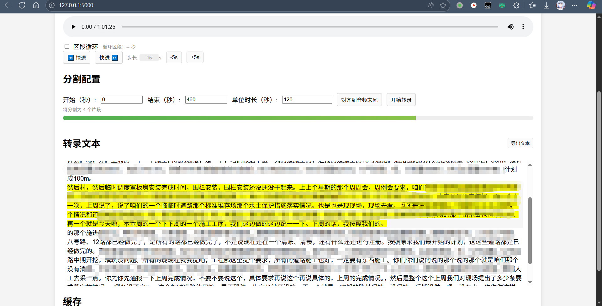

# 音频转录工具 Voice2Text

一个基于 Flask 的音频转录 Web 应用，支持音频文件上传、智能分割和实时转录，使用阿里云 DashScope 的 ASR 服务提供高质量的语音识别功能。



## ✨ 功能特性

### 🎵 音频处理
- **多格式支持**: 支持 WAV、MP3、M4A、MP4、MOV、AAC、FLAC、OGG 等主流音频格式
- **智能分割**: 自动将长音频按指定时长分割，支持 15-180 秒可调节分割单位
- **精确裁剪**: 支持指定开始和结束时间进行音频裁剪
- **缓存优化**: 智能缓存分割结果，避免重复处理

### 🎯 转录功能
- **实时转录**: 基于 Server-Sent Events (SSE) 的流式转录，实时显示进度
- **高质量识别**: 使用阿里云 DashScope Qwen3-ASR-Flash 模型
- **专业术语优化**: 内置建筑工程领域专业词汇优化
- **多语言支持**: 支持中文识别，可扩展其他语言

### 🖥️ 用户界面
- **可视化播放器**: 集成音频播放器，支持区段循环播放
- **实时进度**: 转录进度可视化，支持部分结果预览
- **交互式文本**: 点击转录文本可跳转到对应音频位置
- **导出功能**: 支持转录结果文本导出

### ⚡ 性能优化
- **并发处理**: 多线程安全的音频文件管理
- **内存优化**: 流式处理，避免大文件内存占用
- **缓存管理**: 智能缓存清理，支持手动管理

## 🚀 快速开始

### 环境要求

- Python 3.7+
- FFmpeg (用于音频处理)
- 阿里云 DashScope API Key

### 安装步骤

1. **克隆项目**
   ```bash
   git clone <repository-url>
   cd asr
   ```

2. **安装依赖**
   ```bash
   pip install -r requirements.txt
   ```

3. **安装 FFmpeg**
   
   **Windows:**
   - 下载 [FFmpeg](https://ffmpeg.org/download.html#build-windows) 并添加到系统 PATH
   - 或使用 Chocolatey: `choco install ffmpeg`
   
   **macOS:**
   ```bash
   brew install ffmpeg
   ```
   
   **Linux:**
   ```bash
   sudo apt update
   sudo apt install ffmpeg
   ```

4. **配置环境变量**
   ```bash
   # 复制环境变量模板
   cp .env.example .env
   
   # 编辑 .env 文件，添加你的 DashScope API Key
   DASHSCOPE_API_KEY=sk-your-api-key-here
   ```

5. **启动应用**
   ```bash
   python app.py
   ```
   
   或使用提供的启动脚本：
   ```bash
   # Windows
   start.bat
   ```

6. **访问应用**
   
   打开浏览器访问: http://localhost:5000

## 📖 使用指南

### 基本使用流程

1. **上传音频**: 点击"选择文件"上传音频文件
2. **配置参数**: 设置开始时间、结束时间和分割单位时长
3. **开始转录**: 点击"开始转录"按钮
4. **查看结果**: 实时查看转录进度和结果
5. **导出文本**: 转录完成后可导出文本文件

### 高级功能

#### 区段循环播放
- 勾选"区段循环"复选框
- 设置循环的开始和结束时间
- 音频将在指定区段内循环播放

#### 快进快退控制
- 使用 ⏪ 和 ⏩ 按钮进行快进快退
- 可调节步长（默认15秒）
- 支持 ±5秒 步长调节

#### 缓存管理
- 查看当前缓存大小
- 手动清理缓存释放存储空间
- 缓存文件存储在 `split_audio_transcribe` 目录

## 🏗️ 技术架构

### 后端架构

```
├── app.py              # Flask 主应用
├── audio_splitter.py   # 音频分割模块
├── requirements.txt    # Python 依赖
└── templates/         # 前端模板
    └── index.html     # 主页面
```

### 核心组件

- **Flask Web 框架**: 提供 HTTP 服务和 API 接口
- **ASRClient**: 封装 DashScope ASR 服务调用
- **AudioSplitter**: 基于 FFmpeg 的音频分割处理
- **SSE 流式传输**: 实现实时转录进度推送

### API 接口

#### 1. 音频文件上传
```
POST /upload
Content-Type: multipart/form-data

参数:
- file: 音频文件 (支持 wav, mp3, m4a, mp4, mov, aac, flac, ogg)

响应:
{
  "message": "文件上传成功",
  "filename": "uploaded_filename.wav"
}
```

#### 2. 获取音频元数据
```
GET /audio/metadata

响应:
{
  "filename": "current_audio.wav",
  "duration": 120.5,
  "exists": true
}
```

#### 3. 流式转录接口
```
GET /transcribe/stream?start_time=0&end_time=120&segment_duration=60

参数:
- start_time: 开始时间（秒，默认0）
- end_time: 结束时间（秒，默认60）
- segment_duration: 分割时长（秒，15-180，默认60）

响应: Server-Sent Events 流
事件类型:
- segments: {"type": "segments", "segments_count": 2, "cached": false}
- status: {"type": "status", "message": "splitting"}
- partial: {"type": "partial", "timestamp": 0, "text": "部分转录文本"}
- segment_done: {"type": "segment_done", "timestamp": 0, "text": "完整转录文本"}
- progress: {"type": "progress", "percent": 50}
- error: {"type": "error", "message": "错误信息"}
- done: {"type": "done"}
```

#### 4. 缓存管理
```
GET /cache/info
响应:
{
  "cache_size_mb": 15.2,
  "cache_dirs": 3
}

POST /cache/clear
响应:
{
  "message": "缓存已清理",
  "cleared_size_mb": 15.2
}
```

#### 5. 其他接口

| 接口 | 方法 | 功能 |
|------|------|------|
| `/` | GET | 主页面 |
| `/favicon.ico` | GET | 网站图标 |
| `/uploads/<filename>` | GET | 访问上传的音频文件 |

## ⚙️ 配置说明

### 环境变量

| 变量名 | 必需 | 说明 |
|--------|------|------|
| `DASHSCOPE_API_KEY` | 是 | 阿里云 DashScope API 密钥 |
| `ASR_LANGUAGE` | 否 | 音频语言，可提高精准性 |
| `ASR_SYSTEM_CONTENT` | 否 | 定制化识别文本（类似热词功能） |

ASR_LANGUAGE [可用语言列表](https://help.aliyun.com/zh/model-studio/sensevoice-recorded-speech-recognition-python-sdk?spm=a2c4g.11186623.0.i11#66ac0678d6b4w)

### 应用配置

在 `app.py` 的 `Config` 类中可以调整以下参数：

```python
class Config:
    # 文件上传限制
    MAX_CONTENT_LENGTH = 1024 * 1024 * 100  # 100MB
    
    # 支持的音频格式
    ALLOWED_EXTENSIONS = {"wav", "mp3", "m4a", "mp4", "mov", "aac", "flac", "ogg"}
    
    # ASR 模型配置
    ASR_MODEL = "qwen3-asr-flash"
    ASR_SEGMENT_MAX_SECONDS = 180  # 最大分割时长
```

## 🔧 开发指南

### 项目结构

```
asr/
├── app.py                    # 主应用文件
├── audio_splitter.py         # 音频分割模块
├── requirements.txt          # 依赖列表
├── .env.example             # 环境变量模板
├── .gitignore              # Git 忽略文件
├── start.bat               # Windows 启动脚本
├── static/                 # 静态资源
│   └── favicon.ico
├── templates/              # HTML 模板
│   └── index.html
├── uploads/                # 上传文件目录（运行时创建）
└── split_audio_transcribe/ # 缓存目录（运行时创建）
```

### 扩展开发

#### 添加新的 ASR 服务

1. 在 `ASRClient` 类中添加新的服务提供商支持
2. 实现对应的 `stream_transcribe_file` 方法
3. 更新配置参数

#### 自定义音频处理

1. 修改 `audio_splitter.py` 中的分割逻辑
2. 调整 FFmpeg 参数以优化音质和文件大小
3. 添加新的音频格式支持

## 🐛 故障排除

### 常见问题

**Q: 转录时提示 "未配置 DASHSCOPE_API_KEY 环境变量"**
A: 请确保已正确设置环境变量，可以通过 `.env` 文件或系统环境变量设置。

**Q: 音频上传失败**
A: 检查文件格式是否支持，文件大小是否超过 100MB 限制。

**Q: FFmpeg 相关错误**
A: 确保 FFmpeg 已正确安装并添加到系统 PATH 中。

**Q: 转录结果为空**
A: 检查音频质量，确保音频中包含清晰的语音内容。

### 日志调试

应用运行在 Debug 模式下，可以在控制台查看详细的错误信息和调试日志。

## 📄 许可证

本项目采用 MIT 许可证，详见 LICENSE 文件。

## 🤝 贡献

欢迎提交 Issue 和 Pull Request 来改进项目！

## 📞 支持

如有问题或建议，请通过以下方式联系：

- 提交 [GitHub Issue](https://github.com/Mcayear/Voice2Text/issues)